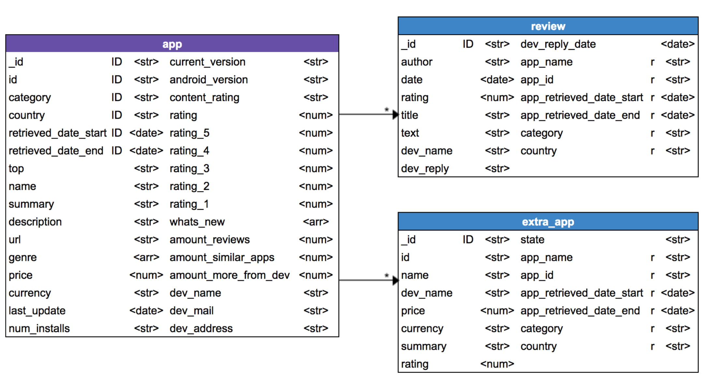

The amount of Android apps available for download is constantly increasing, exerting a continuous pressure on developers to publish outstanding apps. Google Play (GP) is the default distribution channel for Android apps, which provides mobile app users  with metrics to identify and report apps quality such as rating, amount of downloads, previous users comments, etc. In addition to those metrics, GP presents a set of top charts that highlight the outstanding apps in different categories. Both metrics and top app charts help developers to identify whether their development decisions are well valued by the community. Therefore, app presence in these top charts is a valuable information when understanding the features of top-apps. In this paper we present **Hall-of-Apps**, a dataset containing top charts' apps metadata extracted (weekly) from GP, for 4 different countries, during 30 weeks. The data is presented as (i) raw HTML files, (ii) a MongoDB database with all the information contained in app's HTML files (_e.g.,_ app description, category, general rating, etc.), and (iii) data visualizations built with the _D3.js_ framework.

## Publications

Coming Soon!

## Technologies

To generate the Hall-of-Apps, we used the process below to extract, parse, store and visualize the data:

### Google Play Scrapper

  To achieve the first part, we used a scraper written with <strong>NodeJS scripts </strong>: The first script did the extraction of the list of apps in all the categories' top chart, while the second one was in charge of going through the aforementioned list with the purpose of extracting the associated HTML file for each element of the list.

### HTML Parser

  In addition to the <i>Google Play Scrapper</i>, we developed tool to parse the data in the HTML archives that were collected. For that, it was necessary to do a manual analysis of the HTML files to identify the tags, along with the classes names and identifiers, that contained relevant information and their corresponding data types.

  The parser is written in <strong>Python</strong> using the library <i>Beautiful Soup</i> to search tags and extract its content, in order to store it in a a non-relational database.

#### Important Findings

* After parsing the files, we discovered that the HTML format from weeks 17 to 30, changed, thus, it was necessary to search for the new tags and adapt the parser to recognize when the file had old or new format.

  * Regarding the apps metadata, the new format included different categorical values. In consequence, the amount of categories of fields such as number of installations and android versions, increased. Because of that, we created new categories to homogenize the data and decrease the amount of categories.

  * The information related to the apps **reviews** and **similar apps information** was not stored in HTML tags but in JS arrays. In consequence, it was imperative to recognize the position of each field inside the array and adapt the parser to extract this information. Besides, when performing this analysis, we found reviews' date was written in milliseconds, thus, we didn't change it to date because time zone could be different from the original source. 

* Depending of the country, each app had different currency, which makes the price comparrison infeasible. Thus, we calculated the price in dollars and added a new column with the calculated price.

## Dataset

  The resulting dataset is composed of two storage mechanisms. The first one, which contains the raw HTML files of over 30 weeks, stores those files by week and grouped by month. Each file has a taxonomy to identify the week date in which the apps were extracted, app id, country, top and category where it belongs.

  The second component, contains the information extracted from the HTML files via the <i>developed parser</i>. That processed information was then used to populate a non-relational database, in this case, a MongoDB. We decided to use a non-relational database due to the huge amount of raw files we had and taking into account not all apps contain the same information.

### Database Structure

  

  As shown in the image above, the database consists of three collections. The main collection is called <i><strong>app</strong></i> because it keeps characteristic information about the app and retrieval dates. However, each app could also have <i>reviews</i>, <i>similar apps</i>, and <i>more apps from the same developer</i>, thus, in order to prevent overloading the collection and to make easy to query information about reviews and extra apps, we created two new collections, <i><strong>review</strong></i> and <i><strong>extra app</strong></i>. 

  <i><strong>Review</strong></i> has information about the user who wrote the review, rating, date and, if the developer wrote a response, it also has the text and date. On the other hand, <i><strong>extra app</strong></i> has information about similar apps and more from developer. To distinguish the group where it belongs, each document has an <i>state</i> field which indicates if the app  is a similar app or more from developer app.

  Additionally, since an app could appear in different countries, multiple weeks, or even in different tops, we defined primary and foreign keys composed by: <i>retrieved date start and end</i>, <i>app id</i>, <i>category</i> and <i>country</i>. In addition, this was done to keep a relation between <i><strong>app</strong></i>, <i><strong>review</strong></i> and <i><strong>extra app</strong></i>.

### Visualizations Scripts

  Finally, in order to facilitate the understanding of our dataset, we generated some visualizations, as shown inside this web page, that aim to explain some of the metrics, distributions and statistics of the data in the non-relational database.

  The scripts used to generate the visualizations are written in <strong>JavaScript</strong> using the library <i>Data Driven Documents</i>, or <i>D3</i>, to generate custom charts and diagrams. In detail, each of the scripts contains a function that generates a particular chart/visualization (for example, a Stacked Bar Chart) using as input CSV files that contain synthesized information of various aggregations and/or queries made in the non-relational database.

## Metrics and Statistics

  We have collected our dataset from the GP website, checking the first 100 apps in the top free, top selling and the editor choice. Each app has a summary, description, rating, amount of stars, reviews, genre, price, last update, version, required android versions, developer, similar apps, more apps from developer, etc.

  As we explained previously, our dataset is composed of two storage mechanisms: The first one contains raw HTML files stored week by week over 30 weeks. The following table shows the number of extracted HTML files by month.

 

| Year  | Month | # Extracted Files|
| :-------------: | :----------: | :----------: |
| 2017 | November | 87700 |
| 2017 | December | 111989 |
| 2018 | January | 90154 |
| 2018 | February | 89286 |
| 2018 | March | 89545 |
| 2018 | April | 115459 |
| 2018 | May | 89908 |

  On the other hand, the second one is a non-relational database with all the processed information. The following figure depicts the amount of apps metadata extracted from the Google Play Store, grouped by month and subdividing it by country:

 

<input type="checkbox" id="chartCountriessort">	Toggle sort 
<svg id="chartCountries" width="500" height="450"></svg>

  <small>
    The following chart aims to describe the total number of applications in our dataset, per month, as well as the distribution per <i>Country</i> in each month.
  </small>

 

### General Findings

  Furthermore, it's worth noting that we extracted the best apps of the Google Play Store, thus, our non-relational database contains the <i>top free</i> and <i>top selling</i> apps for each category, as well as the <i>editors choice</i> in each country:

 

Select Input <select id="chartTopsxaxis"></select>
<input type="checkbox" id="chartTopssort">	Toggle sort 
<svg id="chartTops" width="500" height="600"></svg>

  <small>
    The following chart aims to describe the total number of applications in our dataset per month, as well as the distribution per <i>Category</i> in each month, filtering by <i>tops</i> that were described previously.
  </small>

  The figure above shows that our dataset contains 34 differents app <i>categories</i>. In order to ease the global analysis of the apps, we added to this page some <strong>mapped <i>macro categories</i></strong>. These new <i>macro categories</i> were generated by grouping the original categories by their similarity. The following table depicts the new <i>macro categories</i>, and the figure below it aims to describe the total number of applications in our dataset per month, as well as the subdividing it by <i>Macro Categories</i> in each month, filtering by <i>tops</i>.

 

Select Input <select id="chartCustomCatxaxis"></select>
<input type="checkbox" id="chartCustomCatsort">	Toggle sort 
<svg id="chartCustomCat" width="500" height="620"></svg>

<table>
  <thead>
    <th>Mapped Category</th>
    <th>Original Category</th>
  </thead>
  <tbody>
    <tr><td rowspan="3">tools_libraries _general</td><td>Tools</td></tr>
    <tr><td>Libraries & Demo</td></tr>
    <tr><td>General</td></tr>
    <tr><td rowspan="3">entertainment_events_food </td><td>Entertainment</td></tr>
    <tr><td>Events</td></tr>
    <tr><td>Food & Drink</td></tr>
    <tr><td rowspan="3">social_dating_communication</td><td>Social</td></tr>
    <tr><td>dating</td></tr>
    <tr><td>communication</td></tr>
    <tr><td rowspan="3">health _medical_sports</td><td>Health & Fitness</td></tr>
    <tr><td>Medical</td></tr>
    <tr><td>Sports</td></tr>
    <tr><td rowspan="3">music _video _auto </td><td>Music & Audio</td></tr>
    <tr><td>Video Player</td></tr>
    <tr><td>Auto & Vehicles</td></tr>
    <tr><td rowspan="3">art _photography_personalization</td><td>Art & Design</td></tr>
    <tr><td>Photography</td></tr>
    <tr><td>Personalization</td></tr>
    <tr><td rowspan="3">beauty_shopping_lifestyle</td><td>Beauty</td></tr>
    <tr><td>Shopping</td></tr>
    <tr><td>Lifestyle</td></tr>
    <tr><td rowspan="3">books _news _comics</td><td>Books & Reference</td></tr>
    <tr><td>News & Magazines</td></tr>
    <tr><td>Comics</td></tr>
    <tr><td rowspan="3">business_finance_productivity</td><td>Business</td></tr>
    <tr><td>Finance</td></tr>
    <tr><td>Productivity</td></tr>
    <tr><td rowspan="3">house _parenting_education</td><td>House & Home</td></tr>
    <tr><td>Parenting</td></tr>
    <tr><td>Education</td></tr>
    <tr><td rowspan="3">maps _travel _weather</td><td>Maps & Navigation</td></tr>
    <tr><td>Travel & Local</td></tr>
    <tr><td>Weather</td></tr>
    <tr><td>EditorChoice</td><td>EditorChoice</td></tr>
  </tbody>
</table>

### App Collection Discoveries

  This collection has <strong>YYY</strong> records and a total of <strong>36</strong> fields. The following figure depicts the fields data-type distribution.  

Select Input <select id="chartTypesAppxaxis"></select>
<svg id="chartTypesApp" width="500" height="450"></svg>

  As the figure shows, the <i>String</i> data-type is predominant in this collection, folowed by <i>Numeric</i> fields. In the same way, it's possible to evidence the same proportions when lookin at each individual country.

  In addition to the above, the table below shows the data types of each of the fields of the collection, as well as the percentage of null values. It is important to clarify that this analysis was done with a sample of <strong>70000</strong> records from the collection.

| Atribute Name | Type| % Null Values | Predominant Values |
| :-------------: | :----------: | :-----------: | :-----------: |
| _id | Object | 0% | N/A |
| amount_more_from_developer_apps | Numeric | 35.5% | 0 (~30%), 16 (~24%)
| amount_reviews | Numeric | 64.5% | 38 (~64%) |
| amount_similar_apps | Numeric | 35.5% | 18 (~64%), 16 (~27%) |
| android_version | String | 0.3% | "4.1 and up" (~21%), "4.0.3 and up" (~15%) |
| category | String | 0% | N/A |
| content_rating | String | 0% | "Everyone" (~46%), "USK: All ages" (~22%) |
| country | String | 0% | "co" (~26%), "us" (~26%), "de" (~25%), "br" (~22%) |
| currency | String | 0% | "COP" (~26%), "$" (~26%), "€" (~25%), "R\$" (~22%) |
| current_version | String | 2.4% | "Varies with device" (~14%), "1.0" (~6%) |
| description | String | 0% | N/A |
| dev_address | String | 54% | N/A |
| dev_mail | String | 0% | N/A |
| dev_name | String | 0% | N/A |
| genre | Array | 0% | N/A |
| has_specific_version | Bool | 0% | false (~86%) |
| has_whats_new | Bool | 0% | true (~64%) |
| id | String | 0% | N/A |
| last_update | Date | 0% | N/A |
| name | String | 0% | N/A |
| num_installs | String | 0% | "+1" (~35%) |
| price | Numeric | 0% | N/A |
| price_usd | Numeric | 0% | N/A |
| rating | Numeric | 1.7% | 4.4 (~40%), 4 (~22%) |
| rating_1 | Numeric | 23.8% | N/A |
| rating_2 | Numeric | 23% | N/A |
| rating_3 | Numeric | 22.4% | N/A |
| rating_4 | Numeric | 21.9% | N/A |
| rating_5 | Numeric | 21.5% | N/A |
| required_version | String | 0% | "Ice CreamSandwich and up" (~30%), "Jelly Bean and up" (~25%) |
| retrieved_date_end | Date | 0% | N/A |
| retrieved_date_start | Date | 0% | N/A |
| summary | String | 0% | N/A |
| top | String | 0% | "topFree" (~57%), "topSelling" (~40%) |
| url | String | 0% | N/A |
| whats_new | Array | 0% | N/A |

### Review Collection Discoveries

Select Input <select id="chartTypesReviewxaxis"></select>
<svg id="chartTypesReview" width="500" height="450"></svg>

### Extra App Collection Discoveries

  This collection has <strong>YYY</strong> records and a total of <strong>14</strong> fields. The following figure depicts the fields data-type distribution.  

Select Input <select id="chartTypesExtraxaxis"></select>
<svg id="chartTypesExtra" width="500" height="450"></svg>

  As the figure shows, the <i>String</i> data-type is predominant in this collection, folowed by <i>Date</i> fields. In the same way, it's possible to evidence the same proportions when lookin at each individual country, with the exception of <strong><i>de</i></strong> which has a higher amount of <i>null</i> values.

  In addition to the above, the table below shows the data types of each of the fields of the collection, as well as the percentage of null values. It is important to clarify that this analysis was done with a sample of <strong>90000</strong> records from the collection.

| Atribute Name | Type| % Null Values |
| :-------------: | :----------: | :-----------: | :-----------: |
| _id | Object | 0% |
| app_id | String | 0.2% |
| app_name | String | 0% |
| app_retrieved_date_end | Date | 0% |
| app_retrieved_date_start | Date | 0% |
| category | String | 0% | 
| country | String | 0% | 
| dev_name | String | 0% | 
| id | String | 0% | 
| name | String | 0% | 
| price | String | 20.6% | 
| rating | String | 1.7 | 
| state | String | 0% | 
| summary | String | 0% | 

  From the above, it's worth noting that the majority of the collection fields are <i>unique</i> and, therefore, it wasn't possible to depict predominant values for those fields. Nevertheless, some fields did evidence predominant value such as:  

* The <strong>price</strong> field with a 90% predominance of the value "Free".
* The <strong>rating</strong> field with a 50% predominance of the value "4.5", followed by the value "4.5" with 25%.
* The <strong>state</strong> field with a 72% predominance of the value "similar", followed by the value "more_from_developer" with the remaining percentage.